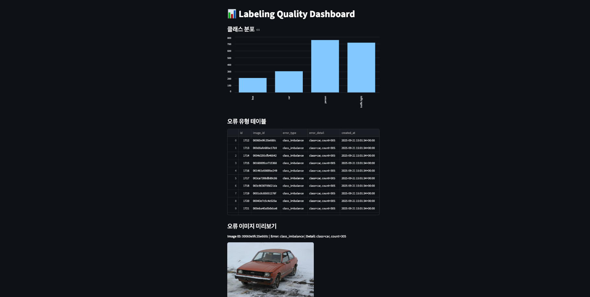

# 📊 Labeling Quality Project

## 소개

Open Images 데이터셋을 활용해 라벨링 품질을 분석하고 오류를 자동 검출·시각화하는 파이프라인입니다.  
DB 관리, 자동화, 시각화 경험을 쌓기 위한 미니 프로젝트입니다.

## 주요 기능

- CSV → PostgreSQL DB 적재
- bbox/이미지 오류 자동 검출
- FastAPI 기반 품질 지표 API
- Streamlit 대시보드 시각화

## 실행 방법

```bash
# Conda 환경 생성
conda create -n labeling_env python=3.10 -y
conda activate labeling_env
conda install -c conda-forge pandas sqlalchemy psycopg2 matplotlib -y
pip install openimages fastapi uvicorn streamlit

# 데이터 다운로드
oi_download_dataset --csv_dir ./openimages_csv --base_dir ./openimages_data \
  --labels "Person" "Car" "Traffic light" "Bus" --format pascal --limit 200

# 변환/적재/품질검사
python src/concat_pascal_to_csv.py
python src/load_to_db.py
python src/quality_check.py

# API 실행
uvicorn src.api_server:app --reload --port 8000

# 대시보드 실행
streamlit run src/dashboard.py
```


